# [바벨딥] - 웹 크롤링 Part.2

[[_TOC_]]

## 0. 사전준비
### Selenium 패키지 설치

```python
# 파이썬 사용자(아나콘다는 기본내장)
pip install selenium
# 미니콘다 사용시
 conda install -c conda-forge selenium 
```

- [Seleium을 위한 Chrome웹드라이버 다운로드](https://chromedriver.storage.googleapis.com/index.html?path=2.36/)
- [Seleium을 위한 Firefox웹드라이버 다운로드](https://github.com/mozilla/geckodriver/releases)

### Git Clone / Download Project

프로젝트를 클론 하거나 [다운로드](https://github.com/TaeckSeung/babel_deep_study3/archive/master.zip)합니다.

```bash
 git clone https://github.com/TaeckSeung/babel_deep_study3.git
```


## 1. 로그인이 필요한 사이트 다운받기

최근 대부분의 대형 웹사이트는 로그인처리시 requests를 활용한 단순 post 명령을 통해 로그인이 이루어지지 않습니다.

> Naver 혹은 Daum과 같은 포털서비스의 경우 Javascript를 통해 암호화과정이 진행됨으로 Requests 단독으로 로그인을 시도하기가 힘듭니다. 

간단히 Requests를 활용한 실습으로, 페이스북의 모바일 버전 URL을 활용하여 그나마 쉽게 requests를 활용하여 로그인을 시도해 포스트 정보를 가져오겠습니다.

### 1-1. Facebook Mobile Website 로그인 프로세스 확인

페이스북 mobile 페이지의 경우, 쉽게 적용할수 있는 Internet Explorer 혹은 Firefox를 통해 접속한 URL을 기반으로 작업을 진행합니다.

> Chrome의 경우 Facebook Mobile버전 URL에서 브라우저 Agent 정보를 인식하여 복잡한 절차의 Login프로세스를 구현하고 있습니다.

먼저, 브라우저로 https://m.facebook.com 접속시 아래와 같이 연결됩니다.

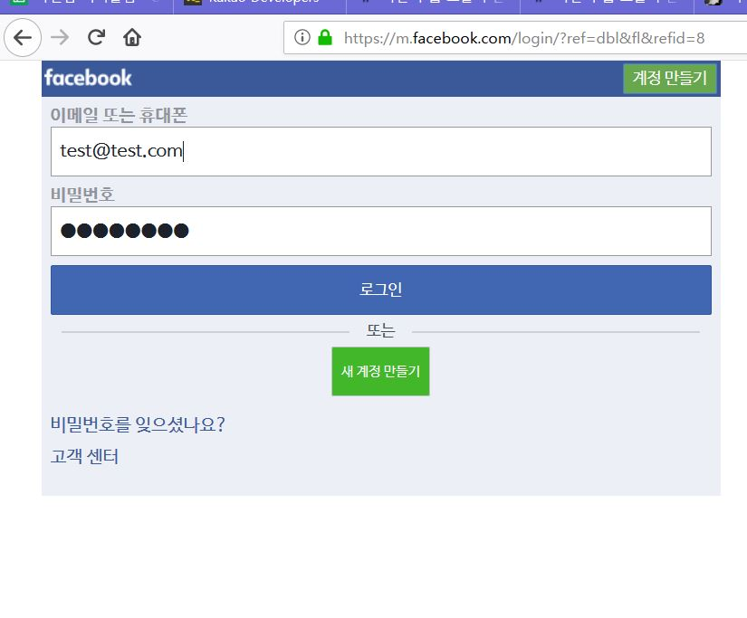

이제 로그인 구현을 위해 실제 로그인 클릭시 일어나는 브라우저상의 HTTP Request정보를 브라우저 확장기능을 통해 확인합니다.(F12 키로 호출)

그리고 로그인 버튼을 클릭시 아래와 같은 URL로 POST요청을 보내는것을 확인할 수 있습니다.

[^URL]: https://m.facebook.com/login.php?refsrc=https://m.facebook.com/?ref=dbl&lwv=101&ref=dbl"


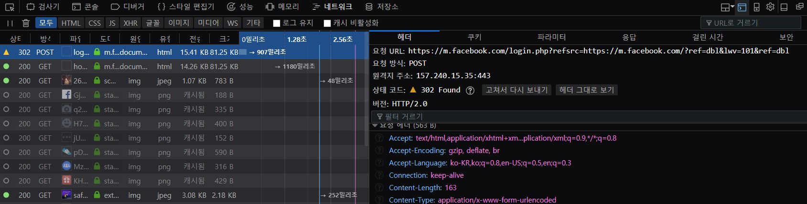

또한 POST 요청 시도와 동시에, 아래 그림처럼 파라미터로 폼에 입력했던 EMAIL, PASSWORD정보와 더불어 부가적인 정보(li,lsd,m_ts) 가 같이 포함되어 요청되어지는것을 확인할 수 있습니다.

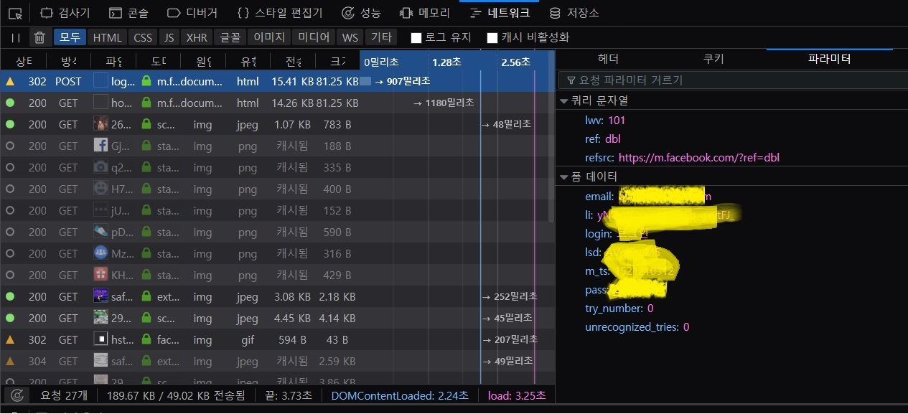

위 과정을 통해 로그인을 하게되면 타임라인을 보게되거나, 때로는 아래와 같이 원클릭 로그인을 요구하는 페이지가 발생합니다.

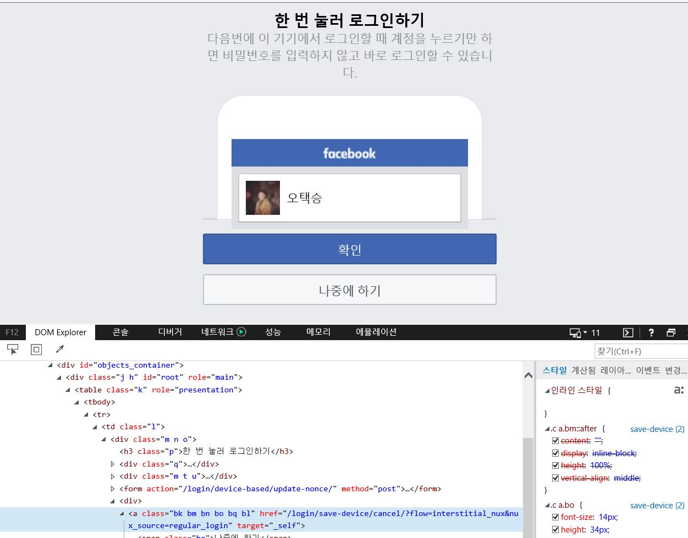

> `원클릭 로그인 페이지`가 나타날시 `나중에 하기`버튼의  URL 링크정보를 보면 디바이스 정보를 저장하지않고 일반적인 로그인을 처리하는 URL로 연결됨을 확인할 수 있습니다. 
> 이는 추후 챕터에서 Requests로 로그인시 타임라인이아닌 위와같은 화면의 html이 Response로 돌아오기때문에 위 캡처로 미리 페이지구성을 파악하여 놓습니다.

`그러나` 이미 로그인 처리는 정상적으로 완료된 상황이므로 https://m.facebook.com 으로 URL을 입력하여도 페이스북 타임라인을 보실 수 있습니다.

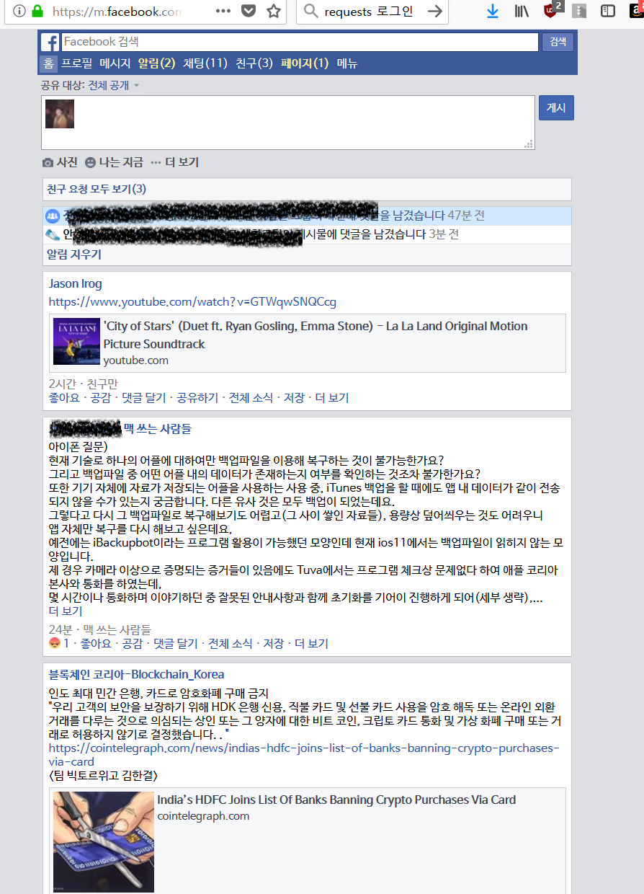

### 1-2. Facebook 로그인 및 이미지 다운로드 코드

이제  첨부된```facebook_login.jpynb``` 파일을 이용하거나, 아래코드를 이용하여 로그인부터 간단하게 이미지 다운로드 까지 진행해 봅니다.

```python
# facebook_login_download.py
# 바벨딥 3회차 - 웹 크롤링 Part.2
# requests와 BeautifulSoup을 활용한 Facebook Mobile 로그인
# Author : TaeckSeung Oh <zbase000@gmail.com>
# Date : 2018.03.16

import requests
from bs4 import BeautifulSoup

# 개인 페이스북 계정 정보 및 Facebook Mobile URL
EMAIL = "test@test.com"
PWD = "test1234"
FACEBOOK_URL = "https://m.facebook.com/"
# 브라우저상에서 로그인 버튼클릭시 로그인정보를 POST하는 URL
LOGIN_URL = "https://m.facebook.com/login.php?refsrc=https://m.facebook.com/?ref=dbl&lwv=101&ref=dbl"

s = requests.session()
#GET DEFAULT VALUES FROM PAGE
r = s.get(FACEBOOK_URL)
soup = BeautifulSoup(r.text)
# 로그인 페이지 확인
print (soup)

#GET DEFAULT VALUES
#tmp = soup.find(attrs={"name": "lsd"})
#lsd = tmp.get("value")
#tmp = soup.find(attrs={"name": "m_ts"})
#m_ts = tmp.get("value")
#tmp = soup.find(attrs={"name": "li"})
#li = tmp.get("value")

#기타 파라미터 없어도 로그인 문제 없음
#data = {
#    'lsd': lsd,
#    'm_ts': m_ts,
#    'li': li,
#}
data = {}
data['email'] = EMAIL
data['pass'] = PWD
data['login'] = 'Log In'

#로그인 처리 요청
r = s.post(LOGIN_URL, data=data)
print (r.text)

# 위에서 로그인 이상이 없을 시 아웃풋에서 유저 이름이 존재,Facebook 메인으로 URL을 이동하여 타임라인을
r = s.get("https://m.facebook.com/")
r.text

soup = BeautifulSoup(r.text,'lxml')
img_list = soup.find_all('img')
print(img_list)

# 임의의 이미지 다운로드
print ('IMG_LIST_LENGTH:',len(img_list))
#아래 img_url을 위한 인덱스값은 img list내에 유효한 인덱스를 사용합니다.
img_url = img_list[10]['src']
res = requests.get(img_url,stream=True)
res.raise_for_status()
with open('facebook_download_img.jpg', 'wb') as handle:
    for block in res.iter_content(1024):
        handle.write(block)
    print('saved')
    
# Jupyter Notebook 에서 저장된 이미지 출력()
from IPython.display import Image, display
display(Image('facebook_download_img.jpg'))
```


## 2. 웹 브라우저를 이용한 스크래핑

### 2-1. Naver 로그인(Selenium 활용)

`Selenium`은 각 브라우저에 Webdriver라는 API를 활용하여 브라우저를 제어할 수 있도록 해주는 모듈입니다.
이는 Javascript를 통한 처리가 많이 일어나는 웹, 혹은 리얼 브라우저 환경에서만 작동할수있는 각종 이벤트 클릭등을 제어하고 데이터를 가져 올 수 있습니다.

이를위해 사전준비한 webdriver를 실행하기 쉽도록 실행시킬 주피터 노트북파일 혹은 소스코드 경로에 저장시켜 놓습니다.

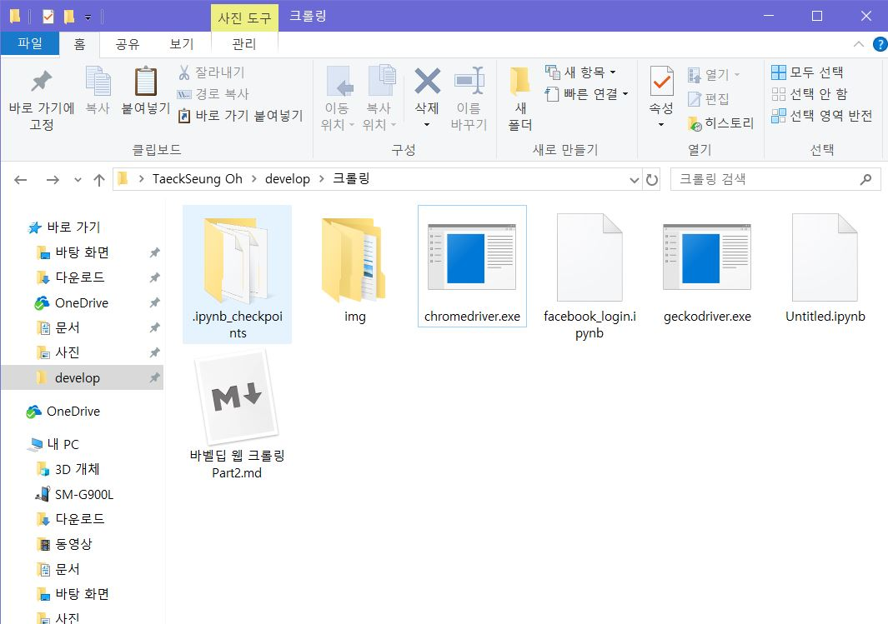

이제 코드를 통해 Selenium으로 웹드라이버를 실행시키고, 이를통해 브라우저를 제어해 보도록 합니다.

```python
from selenium import webdriver
#윈도우 환경
driver = webdriver.Chrome('./chromedriver.exe')
#맥 혹은 리눅스 
#driver = webdriver.Chrome('./chromedriver')
# 브라우저에서 웹 컨텐츠 로딩에 최대 3초까지 대기하도록 설정합니다.
driver.implicitly_wait(3)
# url로 이동
driver.get('https://nid.naver.com/nidlogin.login')
```

> 각자의 OS환경에 따라 아래 Webdriver 가 위치한 경로에 맞추어 파일명을 바꾸어 줍니다.

정상적으로 작동시 새롭게 크롬이 실행되며 네이버 창이 열리게 됩니다.

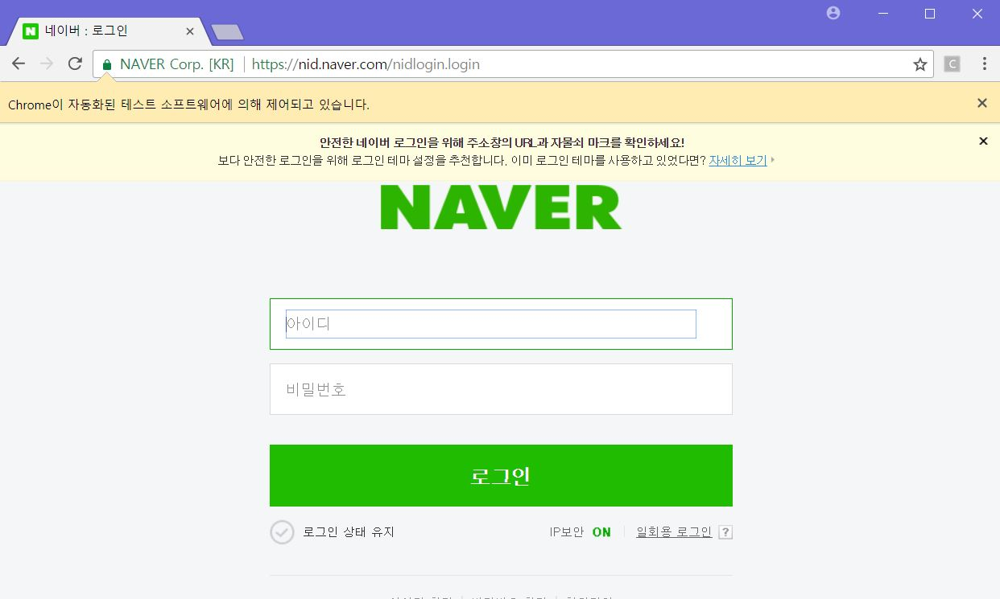

Selenium또한 CSS 선택자를통해 각 엘리먼트에 접근이 가능합니다.
이를위해 브라우저 개발도구(F12)를 열어 아이디, 비밀번호의 선택자를 확인합니다.

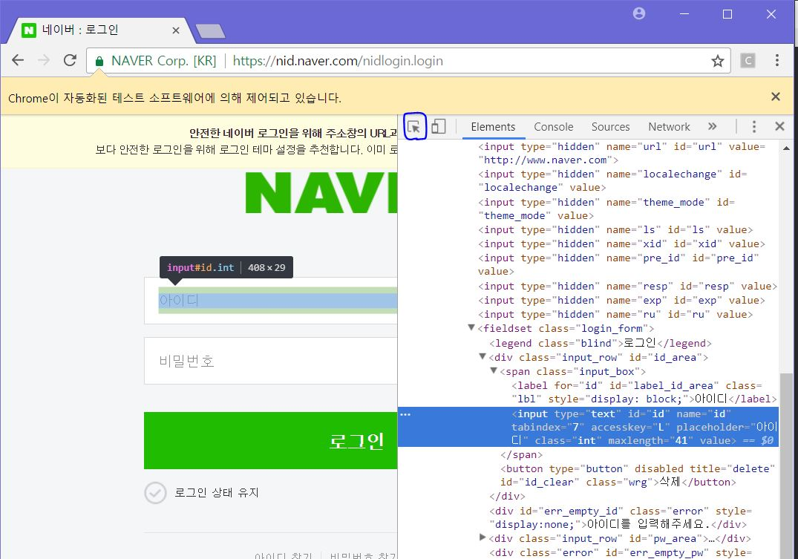

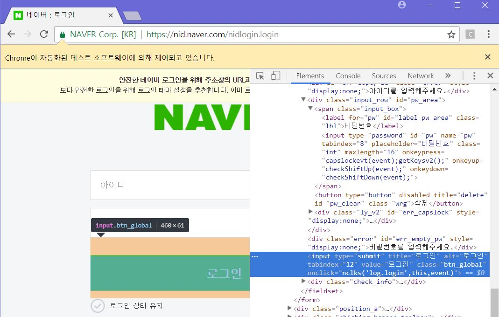

확인결과 아이디와 비밀번호는 각각 name값으로 'id', 'pw'를 가지고 있음을 확인하였습니다.
또한 로그인 버튼은 btn_clobal이라는 class로 선언되어 있습니다.

```python
from selenium import webdriver

driver = webdriver.Chrome('./chromedriver')
driver.implicitly_wait(3)
driver.get('https://nid.naver.com/nidlogin.login')
# send_keys에 개인의 아이디/비밀번호를 입력합니다.
driver.find_element_by_name('id').send_keys('my_id')
driver.find_element_by_name('pw').send_keys('my_passwords')
# 로그인 버튼을 클릭
driver.find_element_by_class_name('btn_global').click()
```

이제 빠른속도로 로그인 폼이 채워지고, 로그인 클릭 이벤트가 발생하면서 로그인이 성공하게 됩니다.

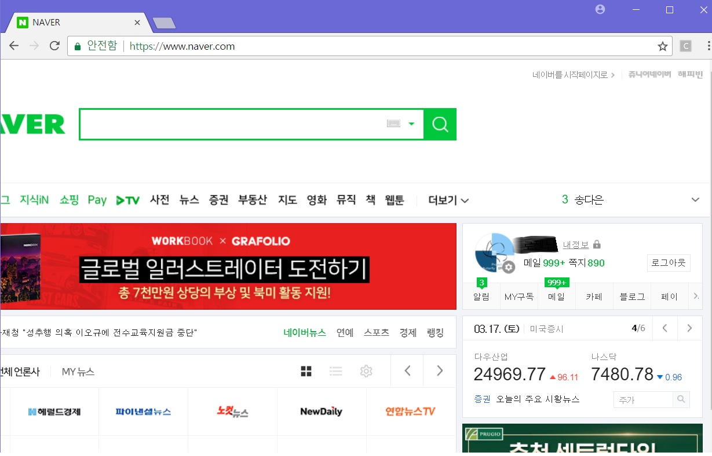

### 2-2 Selenium활용한 데이터 스크래핑

Selenium은 BeautifulSoup과 함께사용하여 현재 브라우저상의 데이터를 가져오고,  이를 쉽게 파싱할 수 있습니다.
쉬운 예시로 네이버 영화에서 어벤져스 시리즈의 제목을 스크래핑 해보도록 하겠습니다.

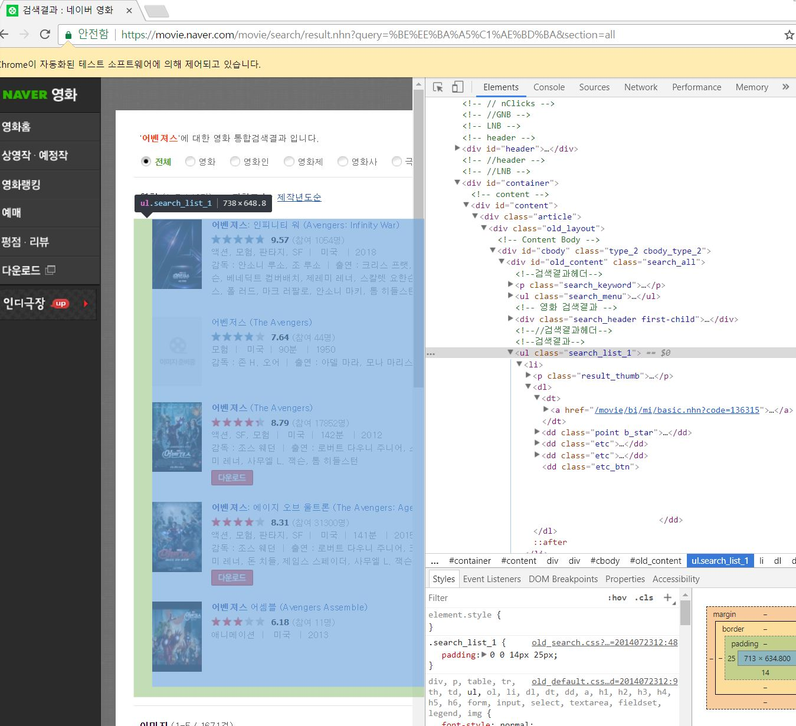

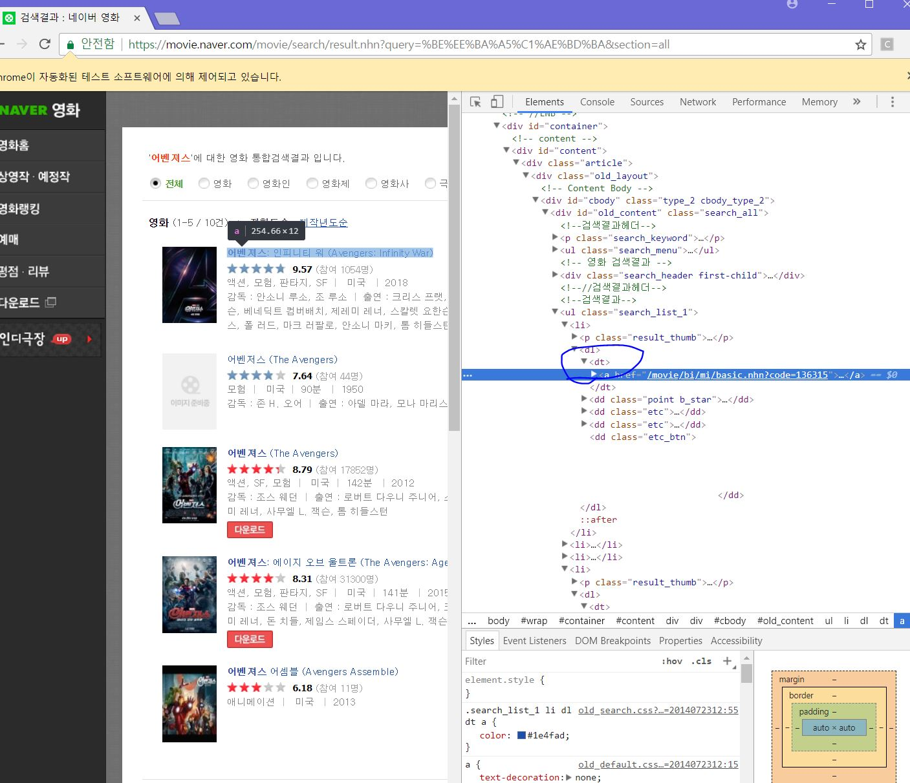

이제 예시로 제목을 수집하기위해, 브라우저 개발툴로 선택자를 확인해둡니다.

이제 아래 코드를 통해 영화 타이틀명을 스크래핑 해봅니다.

```python
from selenium import webdriver
#윈도우 환경
driver = webdriver.Chrome('./chromedriver.exe')
#맥 혹은 리눅스 
#driver = webdriver.Chrome('./chromedriver')
driver.implicitly_wait(3)
# url에 접근한다.
driver.get('https://movie.naver.com/')
driver.find_element_by_id('ipt_tx_srch').clear()
driver.find_element_by_id('ipt_tx_srch').send_keys('어벤져스')
driver.find_element_by_class_name('btn_srch').click()
# driver로 현재 페이지 소스를 가져옵니다.
html = driver.page_source
# 가져온 소스를 BeautifulSoup으로 파싱합니다.
soup = BeautifulSoup(html, 'html.parser')
# 1차로 영화 제목 결과가 보여지는 클래스를 찾습니다.
result = soup.find("ul",{"class":"search_list_1"})
# 각 영화 타이틀이 dt 선택자를 통해 명시되어 있으므로 dt태그를 파싱합니다.
title = result.find_all('dt')
# 파싱된 타이틀명을 텍스트로 가져와 리스트로 만들어줍니다.
title_list = []
for x in title:
    title_list.append(x.get_text())
print(title_list)
```


## 3. 웹 API로 데이터 추출하기

### 위키피디아 API를 활용한 데이터 추출

- [위키피디아 API모음 ](https://ko.wikipedia.org/w/api.php)
- [위키피디아 오픈서치 API](https://ko.wikipedia.org/w/api.php?action=help&modules=opensearch)

> 예시로 사용하려던 openweather는 현재 api key를 생성하는데 문제가 있어 위키피디아 API로 대체합니다.

오픈서치는 키워드를 기반으로 위키피디아내 연관된 키워드를 내포한 부분과, 해당 글을 조회할 수 있는 검색 API 입니다.

예시로 위키피디아에 검색하기위에 쿼리를
브라우저로 [https://ko.wikipedia.org/w/api.php?action=opensearch&search=대한민국](https://ko.wikipedia.org/w/api.php?action=opensearch&search=대한민국)  에 요청시 아래와같이 JSON형태의 결과를 반환 받습니다.


반환된 JSON은 아래와 같은 구조로 되어있습니다.

| JSON KEY |     Column     |
| :------: | :------------: |
|    0     | Search keyword |
|    1     |     Title      |
|    2     |    Contents    |
|    3     |  Article URL   |

이제 위 API 에서 넘겨준 JSON 오브젝트를 다루어, 해당 글 제목과, 링크속  html내용을 BeautifulSoup으로 간단하게 파싱하여 가져와 Python dict형으로 저장해 보도록 합니다.

```python
# 바벨딥 3회차 - 웹 크롤링 Part.2
# 위키피디아 오픈서치 API를 활용한 데이터 추출
# Author : Taeckseung Oh <zbase000@gmail.com>
# Date : 2018.03.16
import requests
import urllib
from bs4 import BeautifulSoup
api = 'https://ko.wikipedia.org/w/api.php?action=opensearch&'
queryset={
    'search' : '대한민국'
}
query = urllib.parse.urlencode(queryset)
url = api + query
print(url)
r = requests.get(url)
data = json.loads(r.text)
print(data)
# 각 제목별로 페이지 링크 속 내용을 저장하는 dictionary를 만들어보자
links = data[3]
titles = data[1]
print (titles)
article_dict={}
for idx, title in enumerate(titles):
    r = requests.get(links[idx])
    soup = BeautifulSoup(r.text)
    contents = soup.find('div',{'class':'mw-parser-output'})
    article_set[title] = contents.get_text()
print (article_dict)
article_dict.keys()
article_set.get('대한민국 제19대 대통령 선거')
```


## 4. Cron을(Linux/Mac), 윈도우(작업스케줄러) 이용한 정기적인 크롤링 

Cron은 Nix계열에서의 작업 스케줄링을 관리해주는 데몬입니다.
윈도우에서는 Task Scheduler로 GUI형태로 운영되고 있지만, 실질적인 운영방법은 유사합니다.

이를 이용해 삼성전자 주식을 하루에 한번씩 기록하는 스케줄링 작업을 진행해 보겠습니다.

먼저 다음 주식의 상단 가격표시의 css 선택자를 분석합니다.

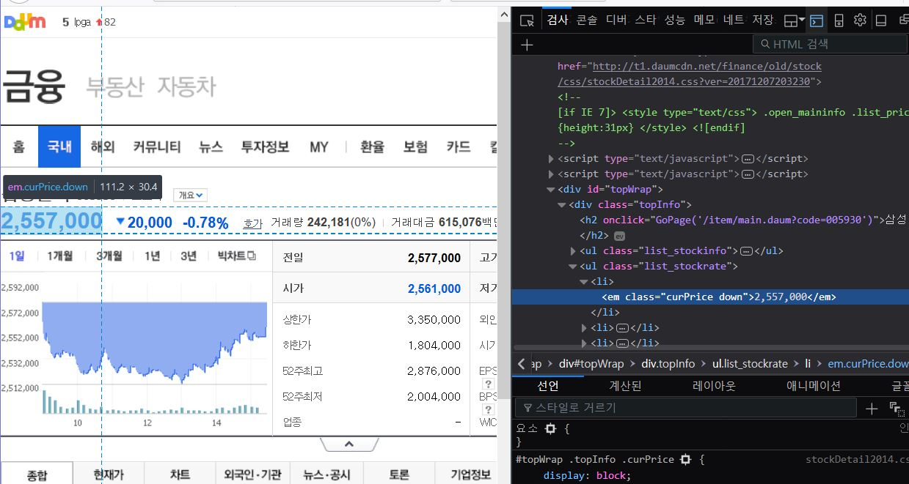

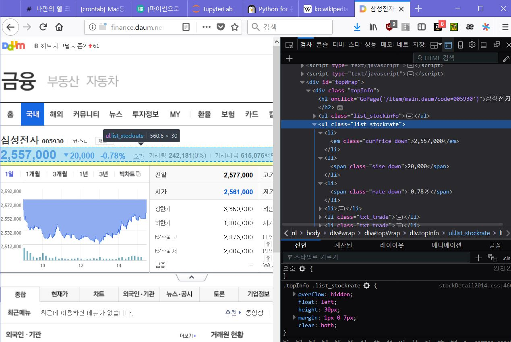

구성은 list_stockrate클래스내에서 첫번째 li의 em요소에 가격이 위치하고있습니다.

이를 기반으로 스크립트가 실행되는 `samsung+날짜` 이름으로 파일내 현재가 가격이 저장되도록 코드를 작성합니다.

```python
# 바벨딥 3회차 - 웹 크롤링 Part.2
# Crontab 활용 스크립트
# Author : Taeckseung Oh <zbase000@gmail.com>
# Date : 2018.03.16
from bs4 import BeautifulSoup
import urllib.request as req
import datetime

# 다음 주식에서 정보가져오기
url = "http://finance.daum.net/item/main.daum?code=005930&nil_profile=vsearch&nil_src=stock"
res = req.urlopen(url)

# Beautiful Soup으로 HTML 분석
soup = BeautifulSoup(res, "html.parser")

# 데이터 추출
top = soup.find(class_="list_stockrate")
price = top.find("em").string
t = datetime.date.today()
fname = t.strftime("%Y-%m-%d")
fname = 'samsung' + fname
with open(fname, "w", encoding="utf-8") as f:
    f.write(price)
    print('saved')
```


### 4-1. Cron

 먼저 Mac/Linux 의 터미널에서 `crontab -e` 를 통해 cron의 스케줄링을 설정할 수 있습니다.

```bash
taeoh@dev:/home/TS$ crontab -e
```

```sh
# 분 시 일  월   요일   명령
# m h  dom mon dow   command
# 매일 특정 스크립트를 실행하는 구문
0 0 * 0 0  python3 /home/test/everyday-dollar.py
```

> [Mac 공식 Cron 튜토리얼](https://support.apple.com/ko-kr/guide/terminal/apdd556274b-9cc9-4764-bba8-87610a745747/mac)
>
> [Linux Crontab 제타위키 튜토리얼](https://zetawiki.com/wiki/%EB%A6%AC%EB%88%85%EC%8A%A4_%EB%B0%98%EB%B3%B5_%EC%98%88%EC%95%BD%EC%9E%91%EC%97%85_cron,_crond,_crontab)

### 4-2. 윈도우 작업 스케줄러

윈도우 작업스케줄러는 아래 예시를 따라 진행할 수 있습니다.
https://wikidocs.net/5857
